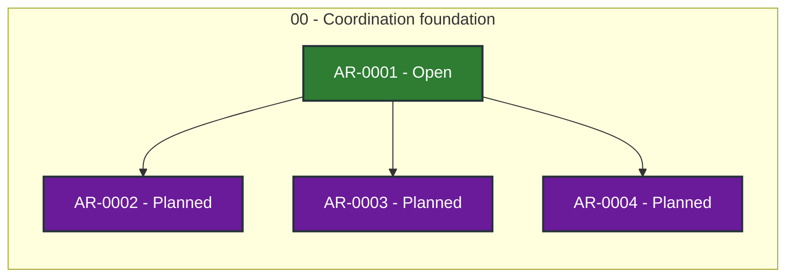

# Agent Workflow Guidance status

> Generated deterministically from task front matter. Do not edit this file directly.
> Status records coordination progress; it is not evidence that product behavior is accepted.

## Portfolio overview

**4 ARs tracked** across 2 active status categories.

| Status | Meaning | Count |
| --- | --- | ---: |
| **In progress** | Claimed work with a live lease | 0 |
| **Open** | Dependency-ready and available to claim | 1 |
| **Blocked** | Cannot proceed until its recorded blocker clears | 0 |
| **Planned** | Defined work awaiting promotion or dependencies | 3 |
| **Future** | Deferred roadmap work | 0 |
| **Done** | Accepted, integrated, and durably verified | 0 |
| **Cancelled** | Stopped with a recorded rationale | 0 |
| **Superseded** | Replaced by another AR | 0 |

## Dependency graph

Arrows point from each prerequisite to the work that depends on it. Color is redundant
with the status text inside every node; the tables below are the complete text
alternative.

### Accessible dependency index

| AR | Prerequisites | Dependents |
| --- | --- | --- |
| [AR-0001](tasks/AR-0001.md) | None | [AR-0002](tasks/AR-0002.md), [AR-0003](tasks/AR-0003.md), [AR-0004](tasks/AR-0004.md) |
| [AR-0002](tasks/AR-0002.md) | [AR-0001](tasks/AR-0001.md) | None |
| [AR-0003](tasks/AR-0003.md) | [AR-0001](tasks/AR-0001.md) | None |
| [AR-0004](tasks/AR-0004.md) | [AR-0001](tasks/AR-0001.md) | None |

## Complete AR inventory

### Open (1)

| Priority | AR | Owner | Summary | Next action |
| --- | --- | --- | --- | --- |
| P0 | [AR-0001](tasks/AR-0001.md): AWG protocol and boundary review | Unclaimed | Establish the oracle-guidance protocol and its authority boundaries. | Review the AWG protocol and identify the smallest executable reference implementation. |

### Planned (3)

| Priority | AR | Owner | Summary | Next action |
| --- | --- | --- | --- | --- |
| P0 | [AR-0002](tasks/AR-0002.md): Offline contract validation | Unclaimed | Add a deterministic contract checker for AWG records. | Implement offline validation and privacy-safe fixtures for request and decision records. |
| P1 | [AR-0003](tasks/AR-0003.md): Coordinator and AWQ integration | Unclaimed | Define the first Coordinator and AWQ integration adapters. | Specify the Coordinator event binding and AWQ quality profile without duplicating either authority. |
| P1 | [AR-0004](tasks/AR-0004.md): Human-guidance evaluation plan | Unclaimed | Evaluate uncertainty, expected regret, batching, and guidance reuse. | Turn the literature review into testable guidance-gate hypotheses and a small evaluation plan. |
