# Agent Workflow Guidance status

> Generated deterministically from task front matter. Do not edit this file directly.
> Status records coordination progress; it is not evidence that product behavior is accepted.

## Portfolio overview

**34 ARs tracked** across 3 active status categories.

| Status | Meaning | Count |
| --- | --- | ---: |
| **In progress** | Claimed work with a live lease | 1 |
| **Open** | Dependency-ready and available to claim | 0 |
| **Blocked** | Cannot proceed until its recorded blocker clears | 0 |
| **Planned** | Defined work awaiting promotion or dependencies | 5 |
| **Future** | Deferred roadmap work | 0 |
| **Done** | Accepted, integrated, and durably verified | 28 |
| **Cancelled** | Stopped with a recorded rationale | 0 |
| **Superseded** | Replaced by another AR | 0 |

## Dependency graph

Arrows point from each prerequisite to the work that depends on it. Color is redundant
with the status text inside every node; the tables below are the complete text
alternative.

```mermaid
flowchart LR
    subgraph series_00["00 - Coordination foundation"]
        direction TB
        AR_0001["AR-0001 - Done"]:::status_done
        AR_0002["AR-0002 - Done"]:::status_done
        AR_0003["AR-0003 - Done"]:::status_done
        AR_0004["AR-0004 - Done"]:::status_done
        AR_0005["AR-0005 - Done"]:::status_done
        AR_0006["AR-0006 - Done"]:::status_done
        AR_0007["AR-0007 - Done"]:::status_done
        AR_0008["AR-0008 - Done"]:::status_done
        AR_0009["AR-0009 - Done"]:::status_done
        AR_0010["AR-0010 - Done"]:::status_done
        AR_0011["AR-0011 - Done"]:::status_done
        AR_0012["AR-0012 - Done"]:::status_done
        AR_0013["AR-0013 - Done"]:::status_done
        AR_0014["AR-0014 - Done"]:::status_done
        AR_0015["AR-0015 - In progress"]:::status_in_progress
        AR_0016["AR-0016 - Planned"]:::status_planned
        AR_0017["AR-0017 - Planned"]:::status_planned
        AR_0018["AR-0018 - Planned"]:::status_planned
        AR_0019["AR-0019 - Planned"]:::status_planned
        AR_0020["AR-0020 - Planned"]:::status_planned
        AR_0021["AR-0021 - Done"]:::status_done
        AR_0022["AR-0022 - Done"]:::status_done
        AR_0023["AR-0023 - Done"]:::status_done
        AR_0024["AR-0024 - Done"]:::status_done
        AR_0025["AR-0025 - Done"]:::status_done
        AR_0026["AR-0026 - Done"]:::status_done
        AR_0027["AR-0027 - Done"]:::status_done
        AR_0028["AR-0028 - Done"]:::status_done
        AR_0029["AR-0029 - Done"]:::status_done
        AR_0030["AR-0030 - Done"]:::status_done
        AR_0031["AR-0031 - Done"]:::status_done
        AR_0032["AR-0032 - Done"]:::status_done
        AR_0033["AR-0033 - Done"]:::status_done
        AR_0034["AR-0034 - Done"]:::status_done
    end
    AR_0001 --> AR_0002
    AR_0001 --> AR_0003
    AR_0001 --> AR_0004
    AR_0001 --> AR_0005
    AR_0001 --> AR_0006
    AR_0001 --> AR_0007
    AR_0001 --> AR_0008
    AR_0001 --> AR_0009
    AR_0001 --> AR_0015
    AR_0001 --> AR_0029
    AR_0002 --> AR_0010
    AR_0002 --> AR_0011
    AR_0002 --> AR_0012
    AR_0002 --> AR_0013
    AR_0002 --> AR_0021
    AR_0003 --> AR_0010
    AR_0003 --> AR_0011
    AR_0003 --> AR_0023
    AR_0004 --> AR_0006
    AR_0004 --> AR_0007
    AR_0004 --> AR_0008
    AR_0004 --> AR_0012
    AR_0004 --> AR_0013
    AR_0004 --> AR_0014
    AR_0004 --> AR_0015
    AR_0004 --> AR_0016
    AR_0004 --> AR_0017
    AR_0004 --> AR_0018
    AR_0004 --> AR_0019
    AR_0004 --> AR_0020
    AR_0006 --> AR_0014
    AR_0006 --> AR_0016
    AR_0007 --> AR_0017
    AR_0007 --> AR_0020
    AR_0008 --> AR_0018
    AR_0008 --> AR_0019
    AR_0009 --> AR_0010
    AR_0009 --> AR_0011
    AR_0009 --> AR_0012
    AR_0009 --> AR_0013
    AR_0021 --> AR_0022
    AR_0021 --> AR_0023
    AR_0021 --> AR_0025
    AR_0021 --> AR_0026
    AR_0021 --> AR_0027
    AR_0021 --> AR_0028
    AR_0021 --> AR_0031
    AR_0022 --> AR_0024
    AR_0022 --> AR_0025
    AR_0022 --> AR_0027
    AR_0022 --> AR_0028
    AR_0022 --> AR_0030
    AR_0022 --> AR_0031
    AR_0023 --> AR_0024
    AR_0023 --> AR_0026
    AR_0023 --> AR_0027
    AR_0023 --> AR_0028
    AR_0025 --> AR_0027
    AR_0026 --> AR_0027
    AR_0027 --> AR_0028
    AR_0031 --> AR_0032
    AR_0032 --> AR_0033
    AR_0033 --> AR_0034
    classDef status_in_progress fill:#1565c0,color:#ffffff,stroke:#263238,stroke-width:2px
    classDef status_open fill:#2e7d32,color:#ffffff,stroke:#263238,stroke-width:2px
    classDef status_blocked fill:#c62828,color:#ffffff,stroke:#263238,stroke-width:2px
    classDef status_planned fill:#6a1b9a,color:#ffffff,stroke:#263238,stroke-width:2px
    classDef status_future fill:#455a64,color:#ffffff,stroke:#263238,stroke-width:2px
    classDef status_done fill:#00695c,color:#ffffff,stroke:#263238,stroke-width:2px
    classDef status_cancelled fill:#616161,color:#ffffff,stroke:#263238,stroke-width:2px
    classDef status_superseded fill:#5d4037,color:#ffffff,stroke:#263238,stroke-width:2px
```

### Accessible dependency index

| AR | Prerequisites | Dependents |
| --- | --- | --- |
| [AR-0001](tasks/AR-0001.md) | None | [AR-0002](tasks/AR-0002.md), [AR-0003](tasks/AR-0003.md), [AR-0004](tasks/AR-0004.md), [AR-0005](tasks/AR-0005.md), [AR-0006](tasks/AR-0006.md), [AR-0007](tasks/AR-0007.md), [AR-0008](tasks/AR-0008.md), [AR-0009](tasks/AR-0009.md), [AR-0015](tasks/AR-0015.md), [AR-0029](tasks/AR-0029.md) |
| [AR-0002](tasks/AR-0002.md) | [AR-0001](tasks/AR-0001.md) | [AR-0010](tasks/AR-0010.md), [AR-0011](tasks/AR-0011.md), [AR-0012](tasks/AR-0012.md), [AR-0013](tasks/AR-0013.md), [AR-0021](tasks/AR-0021.md) |
| [AR-0003](tasks/AR-0003.md) | [AR-0001](tasks/AR-0001.md) | [AR-0010](tasks/AR-0010.md), [AR-0011](tasks/AR-0011.md), [AR-0023](tasks/AR-0023.md) |
| [AR-0004](tasks/AR-0004.md) | [AR-0001](tasks/AR-0001.md) | [AR-0006](tasks/AR-0006.md), [AR-0007](tasks/AR-0007.md), [AR-0008](tasks/AR-0008.md), [AR-0012](tasks/AR-0012.md), [AR-0013](tasks/AR-0013.md), [AR-0014](tasks/AR-0014.md), [AR-0015](tasks/AR-0015.md), [AR-0016](tasks/AR-0016.md), [AR-0017](tasks/AR-0017.md), [AR-0018](tasks/AR-0018.md), [AR-0019](tasks/AR-0019.md), [AR-0020](tasks/AR-0020.md) |
| [AR-0005](tasks/AR-0005.md) | [AR-0001](tasks/AR-0001.md) | None |
| [AR-0006](tasks/AR-0006.md) | [AR-0001](tasks/AR-0001.md), [AR-0004](tasks/AR-0004.md) | [AR-0014](tasks/AR-0014.md), [AR-0016](tasks/AR-0016.md) |
| [AR-0007](tasks/AR-0007.md) | [AR-0001](tasks/AR-0001.md), [AR-0004](tasks/AR-0004.md) | [AR-0017](tasks/AR-0017.md), [AR-0020](tasks/AR-0020.md) |
| [AR-0008](tasks/AR-0008.md) | [AR-0001](tasks/AR-0001.md), [AR-0004](tasks/AR-0004.md) | [AR-0018](tasks/AR-0018.md), [AR-0019](tasks/AR-0019.md) |
| [AR-0009](tasks/AR-0009.md) | [AR-0001](tasks/AR-0001.md) | [AR-0010](tasks/AR-0010.md), [AR-0011](tasks/AR-0011.md), [AR-0012](tasks/AR-0012.md), [AR-0013](tasks/AR-0013.md) |
| [AR-0010](tasks/AR-0010.md) | [AR-0002](tasks/AR-0002.md), [AR-0003](tasks/AR-0003.md), [AR-0009](tasks/AR-0009.md) | None |
| [AR-0011](tasks/AR-0011.md) | [AR-0002](tasks/AR-0002.md), [AR-0003](tasks/AR-0003.md), [AR-0009](tasks/AR-0009.md) | None |
| [AR-0012](tasks/AR-0012.md) | [AR-0002](tasks/AR-0002.md), [AR-0004](tasks/AR-0004.md), [AR-0009](tasks/AR-0009.md) | None |
| [AR-0013](tasks/AR-0013.md) | [AR-0002](tasks/AR-0002.md), [AR-0004](tasks/AR-0004.md), [AR-0009](tasks/AR-0009.md) | None |
| [AR-0014](tasks/AR-0014.md) | [AR-0004](tasks/AR-0004.md), [AR-0006](tasks/AR-0006.md) | None |
| [AR-0015](tasks/AR-0015.md) | [AR-0001](tasks/AR-0001.md), [AR-0004](tasks/AR-0004.md) | None |
| [AR-0016](tasks/AR-0016.md) | [AR-0004](tasks/AR-0004.md), [AR-0006](tasks/AR-0006.md) | None |
| [AR-0017](tasks/AR-0017.md) | [AR-0004](tasks/AR-0004.md), [AR-0007](tasks/AR-0007.md) | None |
| [AR-0018](tasks/AR-0018.md) | [AR-0004](tasks/AR-0004.md), [AR-0008](tasks/AR-0008.md) | None |
| [AR-0019](tasks/AR-0019.md) | [AR-0004](tasks/AR-0004.md), [AR-0008](tasks/AR-0008.md) | None |
| [AR-0020](tasks/AR-0020.md) | [AR-0004](tasks/AR-0004.md), [AR-0007](tasks/AR-0007.md) | None |
| [AR-0021](tasks/AR-0021.md) | [AR-0002](tasks/AR-0002.md) | [AR-0022](tasks/AR-0022.md), [AR-0023](tasks/AR-0023.md), [AR-0025](tasks/AR-0025.md), [AR-0026](tasks/AR-0026.md), [AR-0027](tasks/AR-0027.md), [AR-0028](tasks/AR-0028.md), [AR-0031](tasks/AR-0031.md) |
| [AR-0022](tasks/AR-0022.md) | [AR-0021](tasks/AR-0021.md) | [AR-0024](tasks/AR-0024.md), [AR-0025](tasks/AR-0025.md), [AR-0027](tasks/AR-0027.md), [AR-0028](tasks/AR-0028.md), [AR-0030](tasks/AR-0030.md), [AR-0031](tasks/AR-0031.md) |
| [AR-0023](tasks/AR-0023.md) | [AR-0003](tasks/AR-0003.md), [AR-0021](tasks/AR-0021.md) | [AR-0024](tasks/AR-0024.md), [AR-0026](tasks/AR-0026.md), [AR-0027](tasks/AR-0027.md), [AR-0028](tasks/AR-0028.md) |
| [AR-0024](tasks/AR-0024.md) | [AR-0022](tasks/AR-0022.md), [AR-0023](tasks/AR-0023.md) | None |
| [AR-0025](tasks/AR-0025.md) | [AR-0021](tasks/AR-0021.md), [AR-0022](tasks/AR-0022.md) | [AR-0027](tasks/AR-0027.md) |
| [AR-0026](tasks/AR-0026.md) | [AR-0021](tasks/AR-0021.md), [AR-0023](tasks/AR-0023.md) | [AR-0027](tasks/AR-0027.md) |
| [AR-0027](tasks/AR-0027.md) | [AR-0021](tasks/AR-0021.md), [AR-0022](tasks/AR-0022.md), [AR-0023](tasks/AR-0023.md), [AR-0025](tasks/AR-0025.md), [AR-0026](tasks/AR-0026.md) | [AR-0028](tasks/AR-0028.md) |
| [AR-0028](tasks/AR-0028.md) | [AR-0021](tasks/AR-0021.md), [AR-0022](tasks/AR-0022.md), [AR-0023](tasks/AR-0023.md), [AR-0027](tasks/AR-0027.md) | None |
| [AR-0029](tasks/AR-0029.md) | [AR-0001](tasks/AR-0001.md) | None |
| [AR-0030](tasks/AR-0030.md) | [AR-0022](tasks/AR-0022.md) | None |
| [AR-0031](tasks/AR-0031.md) | [AR-0021](tasks/AR-0021.md), [AR-0022](tasks/AR-0022.md) | [AR-0032](tasks/AR-0032.md) |
| [AR-0032](tasks/AR-0032.md) | [AR-0031](tasks/AR-0031.md) | [AR-0033](tasks/AR-0033.md) |
| [AR-0033](tasks/AR-0033.md) | [AR-0032](tasks/AR-0032.md) | [AR-0034](tasks/AR-0034.md) |
| [AR-0034](tasks/AR-0034.md) | [AR-0033](tasks/AR-0033.md) | None |

## Complete AR inventory

### In progress (1)

| Priority | AR | Owner | Summary | Next action |
| --- | --- | --- | --- | --- |
| P1 | [AR-0015](tasks/AR-0015.md): Planner executor reviewer separation | codex-ar0015-role-separation-20260917 | Test the recommendation-versus-verification boundary. | Specify a planner/executor/reviewer evaluation that keeps oracle intent, execution, and verification separate. |

### Planned (5)

| Priority | AR | Owner | Summary | Next action |
| --- | --- | --- | --- | --- |
| P1 | [AR-0016](tasks/AR-0016.md): Confidence calibration dimensions | Unclaimed | Answer research question 1 on multidimensional confidence. | Design calibration experiments for applicability, outcome, and downstream-impact confidence. |
| P1 | [AR-0017](tasks/AR-0017.md): Oracle packet batching | Unclaimed | Answer research question 2 on batching strategy. | Measure oracle workload and hidden coupling across independent and batched decision packets. |
| P1 | [AR-0018](tasks/AR-0018.md): Reusable guidance lifecycle | Unclaimed | Answer research question 3 on guidance staleness and over-generalization. | Define expiry, scope matching, counterexamples, and review triggers for reusable guidance. |
| P1 | [AR-0019](tasks/AR-0019.md): Anti-rubber-stamp safeguards | Unclaimed | Answer research question 4 on oracle decision quality. | Define signals for omitted alternatives, framing bias, and human rubber-stamp decisions. |
| P1 | [AR-0020](tasks/AR-0020.md): Intervention evidence and future autonomy | Unclaimed | Answer research question 5 on predictive intervention evidence. | Identify intervention evidence that predicts safe autonomy on later dependent tasks. |

### Done (28)

| Priority | AR | Owner | Summary | Next action |
| --- | --- | --- | --- | --- |
| P0 | [AR-0001](tasks/AR-0001.md): AWG protocol and boundary review | Unclaimed | Establish the oracle-guidance protocol and its authority boundaries. | Review the AWG protocol and identify the smallest executable reference implementation. |
| P0 | [AR-0002](tasks/AR-0002.md): Offline contract validation | Unclaimed | Add a deterministic contract checker for AWG records. | Release AR-0002 after merged PR and successful protected checks. |
| P0 | [AR-0021](tasks/AR-0021.md): Formal specification checker | Unclaimed | Make AWG specifications machine-validatable and autonomously checkable. | Release AR-0021 after merged PR and successful protected checks. |
| P0 | [AR-0022](tasks/AR-0022.md): Bootstrap AR topology formalization | Unclaimed | Close the bootstrap gap for the first AR tasks of every AWG project. | Release AR-0022 after the topology checker commit and live verification are published. |
| P0 | [AR-0023](tasks/AR-0023.md): AWG formal-gate enforcement | Unclaimed | Enforce the formal gate at both oracle and implementation boundaries. | Release AR-0023 after merged formal-gate PR and protected checks. |
| P0 | [AR-0027](tasks/AR-0027.md): Conceptual AR authoring gate | Unclaimed | Enforce specification-first authoring for every future conceptual AR. | Make the formal-specification reference and passed-check evidence mandatory when authoring or opening a conceptual AR. |
| P0 | [AR-0028](tasks/AR-0028.md): Self-hosting AWG evolution workflow | Unclaimed | Make Agent Workflow Guidance self-hosting and govern its own evolution. | Apply the AWG workflow to AWG&#x27;s own future design, implementation, quality, and coordination changes after the initial formal gates are complete. |
| P0 | [AR-0029](tasks/AR-0029.md): Pinned AWQ CI enforcement bootstrap | Unclaimed | Make Agent Workflow Quality a required gate for AWG evolution. | Release AR-0029 after the successful hosted AWQ and contracts runs and verified branch protection. |
| P0 | [AR-0030](tasks/AR-0030.md): Specification-gated AR promotion | Unclaimed | Enforce the formal specification gate in Coordinator promotion. | Release AR-0030 after merged product formal-gate specification and state adapter verification. |
| P1 | [AR-0003](tasks/AR-0003.md): Coordinator and AWQ integration | Unclaimed | Define the first Coordinator and AWQ integration adapters. | Release AR-0003 after merged product binding specification and state checker verification. |
| P1 | [AR-0004](tasks/AR-0004.md): Human-guidance evaluation plan | Unclaimed | Evaluate uncertainty, expected regret, batching, and guidance reuse. | Turn the literature review into testable guidance-gate hypotheses and a small evaluation plan. |
| P1 | [AR-0005](tasks/AR-0005.md): Clarification and expected-regret gate | Unclaimed | Model when an agent should clarify instead of acting. | Translate clarification-question and expected-regret literature into an AWG gate and fixtures. |
| P1 | [AR-0006](tasks/AR-0006.md): Uncertainty-aware assistance and calibration | Unclaimed | Transfer uncertainty-aware assistance into software-task guidance. | Define separate calibration measures for applicability, outcome, and downstream-impact confidence. |
| P1 | [AR-0007](tasks/AR-0007.md): Mixed initiative and feedback | Unclaimed | Model human feedback as a durable interaction loop. | Specify correction, confirmation, and resume semantics for mixed-initiative oracle interaction. |
| P1 | [AR-0008](tasks/AR-0008.md): Delegation, control, and bounded authority | Unclaimed | Prevent approval records from laundering uncertainty or accountability. | Define bounded delegation, user control, and authority-scope measures for AWG decisions. |
| P1 | [AR-0009](tasks/AR-0009.md): Public project comparison matrix | Unclaimed | Survey public agent workflow projects without creating runtime dependencies. | Build a public-project comparison matrix with exact revisions, licenses, HITL semantics, and integration boundaries. |
| P1 | [AR-0024](tasks/AR-0024.md): Coordinator formal-evidence binding | Unclaimed | Prevent stale or unverified conceptual decisions from entering coordinated work. | Release AR-0024 after merged evidence-binding specification and checker verification. |
| P1 | [AR-0025](tasks/AR-0025.md): Existing AR formal-spec migration | Unclaimed | Migrate the existing AWG literature and project ARs to the formal-decision rule. | Superseded by the bounded AR-0031 through AR-0034 migration chain. |
| P1 | [AR-0026](tasks/AR-0026.md): AWQ formal-spec quality profile | Unclaimed | Make formal-specification compliance an offline quality contract. | Add AWQ requirements and evidence classification for formal specifications and autonomous checks. |
| P1 | [AR-0031](tasks/AR-0031.md): Formal-spec migration batch one | Unclaimed | Migrate the first formal-decision AR batch. | Migrate AR-0001 through AR-0005 with explicit specification and formal-check references. |
| P1 | [AR-0032](tasks/AR-0032.md): Formal-spec migration batch two | Unclaimed | Migrate the second formal-decision AR batch. | Migrate AR-0006 through AR-0010 with explicit specification and formal-check references. |
| P1 | [AR-0033](tasks/AR-0033.md): Formal-spec migration batch three | Unclaimed | Migrate the third formal-decision AR batch. | Migrate AR-0011 through AR-0015 with explicit specification and formal-check references. |
| P1 | [AR-0034](tasks/AR-0034.md): Formal-spec migration batch four | Unclaimed | Migrate the fourth formal-decision AR batch. | Migrate AR-0016 through AR-0020 with explicit specification and formal-check references. |
| P2 | [AR-0010](tasks/AR-0010.md): LangGraph comparison adapter | Unclaimed | Evaluate LangGraph as a pause/resume host for AWG packets. | Prototype an AWG-to-LangGraph interrupt/checkpoint mapping in an isolated synthetic example. |
| P2 | [AR-0011](tasks/AR-0011.md): AutoGen and Microsoft Agent Framework comparison | Unclaimed | Evaluate multi-agent feedback and migration implications. | Compare AutoGen human feedback with Microsoft Agent Framework&#x27;s supported successor path. |
| P2 | [AR-0012](tasks/AR-0012.md): OpenHands integration study | Unclaimed | Evaluate AWG in a general software-agent host. | Map AWG decision gates onto OpenHands software-agent planning, tool execution, review, and resume points. |
| P2 | [AR-0013](tasks/AR-0013.md): SWE-agent evaluation study | Unclaimed | Study software-engineering agent outcomes with oracle guidance. | Evaluate AWG intervention points against SWE-agent tasks and benchmark evidence without conflating scores with governance. |
| P2 | [AR-0014](tasks/AR-0014.md): Oracle-guided assistance transfer study | Unclaimed | Transfer human-guidance concepts without importing action-level assumptions. | Compare oracle-guided reinforcement-learning assistance with AWG&#x27;s deliberative software decisions. |
